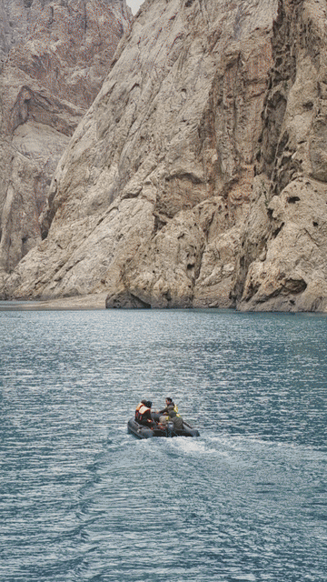
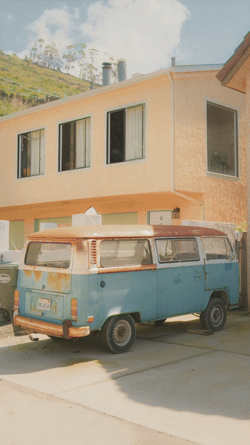

# Collage Film

Turn travel, lifestyle and product photos into subject-first reveal videos with a reusable, forkable Agent Skill.

把一组照片做成「下一张主体先出现 → 原位补全整张照片」的视频。Agent 逐张看图选择主体，调用本地模型抠图与精修，再用 HyperFrames 组合音乐、调色和转场。

## 旅行实测

8 张新旅行照片，4.8 秒，9:16，原创预览音乐与暖色胶片调色。6 张使用自动前景，2 张指定人物后精修。



[下载完整 MP4 和 Skill 包](https://github.com/HenryZABA/collage-film/releases/tag/v0.3.0) · [素材来源、主体选择和复现步骤](examples/travel/README.md)

## 有剪辑脚本的新版

先定“出发 → 城市 → 山野 → 湖面”的概念故事，再执行远近交替与逐镜头拍数。小主体适度放大/移位，街市和结尾多留一拍；横图改用更高分辨率原片。共6秒。



[查看逐镜头脚本与复现步骤](examples/travel/story/README.md) · [新版 Skill ZIP / MP4](https://github.com/HenryZABA/collage-film/releases/tag/v0.4.0)

## 使用

在 Codex 或支持本地 `SKILL.md` 的 Agent 中安装此仓库。可以直接让 Agent 执行：

> 从 https://github.com/HenryZABA/collage-film 安装这个 Skill，并完成本机首次配置。然后用它把我的旅行照片做成视频，先问我平台、比例和音乐偏好。

或手动克隆到技能目录（目标目录需为空）：

```bash
git clone https://github.com/HenryZABA/collage-film.git ~/.codex/skills/collage-film
```

安装后调用：

> 用 $collage-film 处理这个文件夹里的照片，发小红书，3:4，音乐用我提供的文件。咖啡图只要前面那只杯子。

Agent 会询问缺失的发布平台、画幅、素材顺序和音乐选择；选择主体、检查抠图、构建可编辑工程，并按要求导出 MP4。它不会自动发布到社交平台。

## 首次初始化

照片分割在本机进行。三个模型权重约 627 MB，Python 运行依赖另算；模型、虚拟环境和照片都不会随仓库或 fork 复制。同一机器上的 fork 可复用缓存。

需要 Python 3.11/3.12（本机兼容环境也可用）、Node.js、FFmpeg；macOS SAM 原生构建需要 Apple Command Line Tools。Agent 可以代为执行：

```bash
python3 scripts/setup_birefnet.py
python3 scripts/setup_sam2.py
python3 scripts/setup_vitmatte.py
python3 scripts/make.py --doctor
```

这些 setup 自动下载固定版本与哈希校验的模型；普通抠图调用不会暗中安装依赖。默认缓存 `~/.cache/collage-film`，可设置 `COLLAGE_FILM_CACHE`。推理离线，照片不上传。完整配置与许可见 [模型说明](references/cutout.md)。

## 已实现

- **主体判断：** Agent 实际看图，记录保留/排除对象；多个共同主体分别提示后合并。
- **自动前景：** BiRefNet；指定对象采用 SAM 2.1 的框和点。SAM 2 的主体文字用于记录，模型接收几何提示。
- **边缘精修：** SAM mask → trimap → ViTMatte；保持原照片 RGB、全画布尺寸和对位。
- **视频：** HyperFrames 可编辑项目与 MP4；9:16、3:4、4:5、1:1、16:9。
- **剪辑脚本：** 先定故事线与逐镜头衔接，实际执行顺序、拍数、主体大小与位置；记录像素放大和连续小主体提示。详见 [剪辑脚本](references/editing-script.md)。
- **节奏：** 一拍快切或一/两拍交替；默认 100 BPM 下每图 0.6 秒，主体提前 0.2 秒。
- **声音和颜色：** 用户音乐、原创简易预览音乐或静音；暖色胶片、冷色或原色。
- **fork：** 自动改名并保留个人风格预设。

## 自己的版本

可以让 Agent 执行：

> fork $collage-film 成 my-travel-film，保存我喜欢的配色和切换节奏。

```bash
python3 scripts/fork.py --name my-travel-film --destination ~/.codex/skills/my-travel-film
```

新 Skill 的配置在 `assets/preset.json`。用户照片、音乐、登录态与模型缓存不进入 fork。完整流程见 [SKILL.md](SKILL.md)，脚本参数和视频工程格式见 [操作说明](references/operations.md)。

## 验证范围

macOS / Apple Silicon 上实际验证了模型推理、逐图主体选择、边缘精修、独立 fork、9:16 与3:4导出。咖啡杯可以选择两杯或仅前杯；测试中杯身误抠除和边缘锯齿得到改善。

复杂叶片、透明材质、遮挡和相近颜色仍需看图复查。棕榈测试的叶间天空残留未通过。模型自估分数、alpha 非空或脚本通过都不是视觉验收；Windows/Linux、CPU 与 4K 精修未完整验证。任意歌曲自动检测拍点尚未实现，节奏使用已知 BPM 或手工时间。

## 许可

本项目原创代码和文档采用 [MIT](LICENSE)。GSAP、模型权重和上游实现各自遵循独立许可，见 [第三方说明](THIRD_PARTY_NOTICES.md)。图库素材和音乐的许可独立于代码许可。
