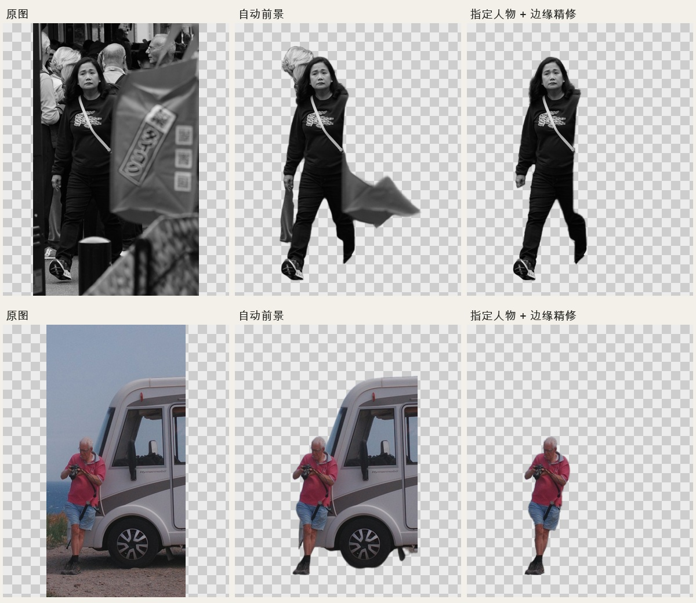

# Travel demo sources

Eight standard free Unsplash photos, verified on 2026-10-05. Source photos are downloaded separately and are not included in the Skill fork. The rendered demonstration is a modified composition; the root code license does not cover stock photos.

| Photo | Photographer | Source |
| --- | --- | --- |
| van | Dan Begel | [Unsplash](https://unsplash.com/photos/pHgJ6zYvTc4) |
| coastal-camper | Ilinca Roman | [Unsplash](https://unsplash.com/photos/tmayqDNex-w) |
| hanoi | Tuaans | [Unsplash](https://unsplash.com/photos/orEPbNAgwvM) |
| lake-boat | sayan Nath | [Unsplash](https://unsplash.com/photos/7SM8Qy7TqbU) |
| street-market | Haewon Oh | [Unsplash](https://unsplash.com/photos/S2Fl6B_wE9U) |
| kimono | Svetlana Gumerova | [Unsplash](https://unsplash.com/photos/9_aiGIn1pLM) |
| cyclist | Fotis Fotopoulos | [Unsplash](https://unsplash.com/photos/h5YTZW2l51U) |
| hikers | Toomas Tartes | [Unsplash](https://unsplash.com/photos/Yizrl9N_eDA) |

Photo terms: [Unsplash License](https://unsplash.com/license). Music is the Skill’s original procedural preview bed, generated locally for this test.

Rendering settings: 9:16, 1080×1920, 30fps, reference pace at 100 BPM (0.6 seconds per photo), 0.2-second foreground prelude, warm-film grading.

The source metadata includes the exact downloaded image URL, checksum and dimensions. Six photos use BiRefNet; the coastal camera man and the black-clothed market woman use SAM 2.1 + ViTMatte. The crowded market baseline included another person and a foreground banner; geometry-based selection removed those distractors. Source occlusion remains visible: hidden limbs are not reconstructed. Boat/cyclist subjects are small and inherently blurred, so the masks do not recover extra detail. Full canvas and original RGB were checked for all eight outputs.



## Rendered result


[Download the full 1080×1920 MP4](https://github.com/HenryZABA/collage-film/releases/download/v0.3.0/travel-demo.mp4). [Rendered transition frames](rendered-contact-sheet.jpg) and [validation](validation.json).

## Reproduce

From the repository root, after model setup:

```bash
python3 examples/travel/download.py --output ./travel-photos
python3 scripts/make.py \
  --images travel-photos/lake-boat.jpg travel-photos/van.jpg travel-photos/kimono.jpg travel-photos/hikers.jpg travel-photos/coastal-camper.jpg travel-photos/hanoi.jpg travel-photos/street-market.jpg travel-photos/cyclist.jpg \
  --subjects examples/travel/subjects.json \
  --output ./my-travel-demo --platform instagram --ratio 9:16 \
  --demo-music --pace reference --bpm 100 --lead-in 0.2 --grade warm-film --check
```

Inspect cutouts and transition snapshots, then render the generated project when requested. The example plan is tied to these exact source photos, not reusable geometry for other images. [Visual review](visual-review.json) records each subject and known limits.
